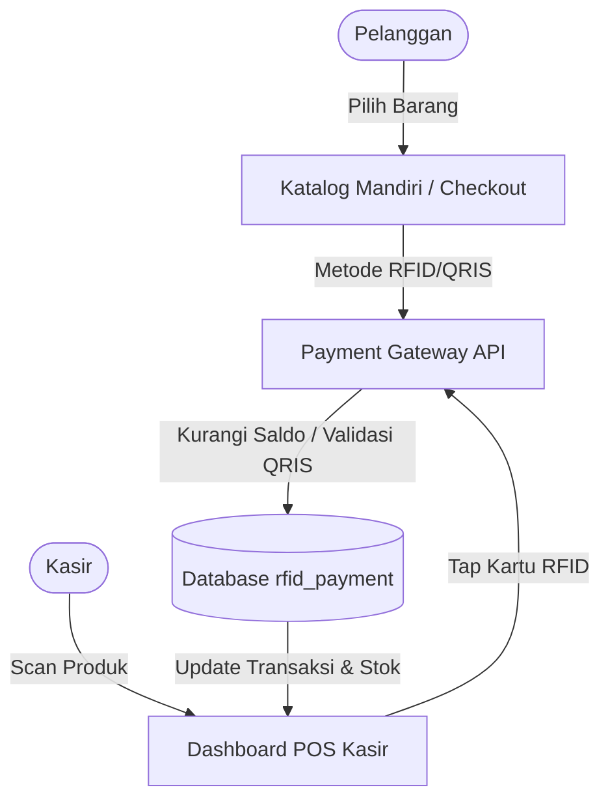

# 🛒 Toko Kelontong & RFID Payment - Warung Fitri Lopet

Sistem Manajemen Toko Kelontong, Point of Sale (POS) Kasir, dan Integrasi Pembayaran RFID/QRIS berbasis **CodeIgniter 4** dan **MySQL**.

---

## 📌 Alur Kerja Sistem

Aplikasi ini menghubungkan antarmuka kasir (POS), katalog mandiri pelanggan, dan pemroses pembayaran RFID/QRIS secara real-time.



---

## ⚡ Fitur Utama

- **🖥️ Point of Sale (POS) Kasir**
  - Input barang belanjaan dengan cepat melalui dashboard kasir.
  - Integrasi pembacaan kartu RFID/NFC untuk pembayaran instan sekali tap.
  - Sinkronisasi status transaksi & pencetakan nota secara langsung.
- **🛍️ Katalog Pelanggan & Checkout Mandiri**
  - Antarmuka web yang ramah pengguna untuk pelanggan memilih produk sendiri.
  - Pembayaran mandiri via **QRIS** (otomatis memunculkan kode QR) atau **RFID**.
- **🔑 Admin Panel (Kelola Produk & Stok)**
  - Pengelolaan data produk secara dinamis (Nama Produk, SKU, Kategori, Harga Beli, Harga Jual, & Stok).
  - Manajemen stok terintegrasi dengan Supplier (pembelian masuk / restok).
  - Proteksi keamanan akses dashboard admin.
- **💳 Payment Gateway Integration**
  - Manajemen saldo kartu RFID pelanggan.
  - Log audit lengkap dari aktivitas tap kartu RFID (*RFID Logs*).

---

## 📁 Struktur Direktori Utama

- [`app/Controllers/`](file:///mnt/samba-toko-kelontong/app/Controllers/) - Logika aplikasi (POS, Checkout, Admin, dll).
- [`app/Views/`](file:///mnt/samba-toko-kelontong/app/Views/) - Antarmuka pengguna (Tampilan Dashboard Kasir, Katalog, dll).
- [`app/Config/Routes.php`](file:///mnt/samba-toko-kelontong/app/Config/Routes.php) - Pengaturan rute URL sistem.
- [`.env`](file:///mnt/samba-toko-kelontong/.env) - Konfigurasi database & baseURL lingkungan lokal.

---

## ⚙️ Kebutuhan Sistem

- **PHP**: Versi 8.2 atau lebih baru.
- **Database**: MySQL 5.7+ atau MariaDB 10.3+.
- **Ekstensi PHP**: `intl`, `mbstring`, `mysqlnd`, `curl`, `json`.

---

## 🚀 Panduan Instalasi

### 1. Kloning & Persiapan Berkas
Buka terminal Anda di direktori proyek:
```bash
git clone git@github.com:id0s/toko-kelontong.purujekuto.biz.id.git
cd toko-kelontong.purujekuto.biz.id
```

### 2. Konfigurasi Lingkungan (`.env`)
Salin berkas `.env.example` menjadi `.env` (atau buat berkas `.env` baru jika belum ada):
```ini
# Atur URL aplikasi
app.baseURL = 'http://localhost:8080/'

# Salin konfigurasi database berikut
database.default.hostname = localhost
database.default.database = rfid_payment
database.default.username = USERNAME_DB_ANDA
database.default.password = PASSWORD_DB_ANDA
database.default.DBDriver = MySQLi
database.default.port = 3306
```

### 3. Impor Database
Buat database bernama `rfid_payment` di server MySQL Anda, lalu impor skema database dari repositori payment gateway:
```sql
# Impor berkas install.sql yang berisi struktur tabel users, products, transaksi, dsb.
SOURCE install.sql;
```

### 4. Jalankan Server
Gunakan perintah bawaan CodeIgniter untuk menjalankan server lokal:
```bash
php spark serve
```
Aplikasi dapat diakses melalui peramban web di: `http://localhost:8080`

---

## 🔐 Kredensial Default

- **Halaman Admin**: `http://localhost:8080/admin`
- **Password Admin**: `perintis29`

> [!WARNING]
> Sangat disarankan untuk mengubah password default pada file `app/Controllers/Admin.php` atau tabel database admins sebelum melakukan deploy ke server produksi.
